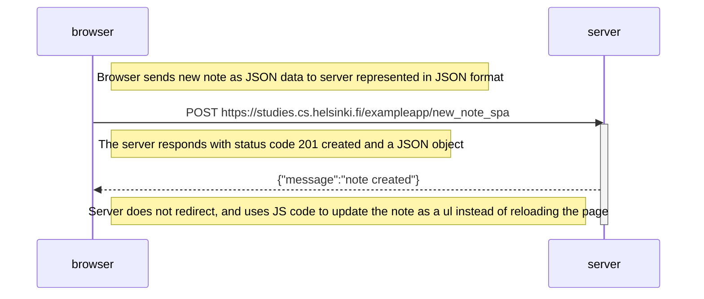

```mermaid
sequenceDiagram
  participant browser
  participant server

  Note right of browser: Browser sends new note as JSON data to server represented in JSON format
  browser->>server: POST https://studies.cs.helsinki.fi/exampleapp/new_note_spa
  activate server
Note right of browser: The server responds with status code 201 created and a JSON object
  server-->>browser: {"message":"note created"}
Note right of browser: Server does not redirect, and uses JS code to update the note as a ul instead of reloading the page
   deactivate server
```
